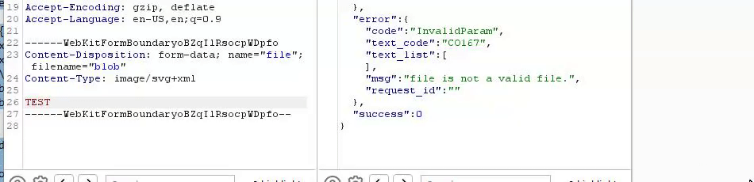

# MagicByteSelector
Burp Suite Extension for inserting a magic byte into responder's request

# Preview



# What this does

Some web applications use a security feature for their file upload checks which validates the first bytes of the sent data also known as Magic Byte which

allows for the identification of the file type, for instance 'GIF87a' corresponds to a file with .GIF file extension.

Now lets say you try to upload ``` <?php echo 'test'?> ``` the web application will throw an error saying that it wont accept the file

However if you make it ``` GIF87a <?php echo 'test'?> ``` in some cases the web application will think its a GIF and will allow the file to be uploaded!

This extension will allow you to insert these Magic Bytes straight from burp suite into your request.

# Like this extension?

If you like this extension than you can show your support by giving us a Google Review

and/or giving a Star to this project here on Github

Google: https://g.page/r/CVTFTdnvWiKzEB0/review

Trustpilot: https://www.trustpilot.com/review/websec.nl

Thank you!

# Ideas, Suggestions or Bug Reports?

You can go to our website and submit the contact form: [websec](https://websec.nl)

If as a result of your contribution we will improve the code then we will make sure to mention your name as a contributor :)
